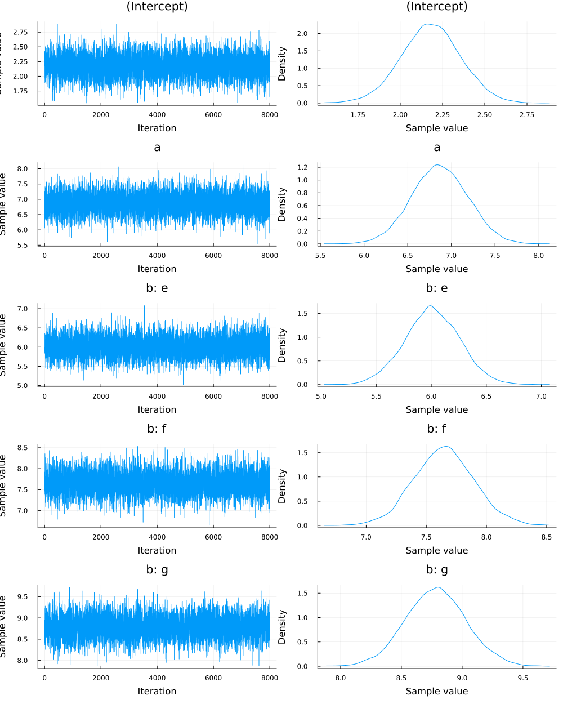

Original source for the example data and code from [`StatsModels.jl`](https://juliastats.org/StatsModels.jl/latest/formula/#Fitting-a-model-from-a-formula)

```julia
using Pkg
Pkg.add(["GLM","DataFrames","StatsModels","StableRNGs"])
```

```julia
using NextGP,GLM,DataFrames,StatsModels,StableRNGs
```

```julia
rng = StableRNG(1)
```

```julia
data = DataFrame(a = rand(rng, 100), b = repeat(["d", "e", "f", "g"], 25))
```

```julia
f = @formula(y ~ 1 + a*b)
```

    FormulaTerm
    Response:
      y(unknown)
    Predictors:
      1
      a(unknown)
      b(unknown)
      a(unknown) & b(unknown)


```julia
X = StatsModels.modelmatrix(f.rhs, data)
```


    100×8 Matrix{Float64}:
     1.0  0.585195   0.0  0.0  0.0  0.0        0.0       0.0
     1.0  0.0773379  1.0  0.0  0.0  0.0773379  0.0       0.0
     1.0  0.716628   0.0  1.0  0.0  0.0        0.716628  0.0
     1.0  0.320357   0.0  0.0  1.0  0.0        0.0       0.320357
     1.0  0.653093   0.0  0.0  0.0  0.0        0.0       0.0
     1.0  0.236639   1.0  0.0  0.0  0.236639   0.0       0.0
     1.0  0.709684   0.0  1.0  0.0  0.0        0.709684  0.0
     1.0  0.557787   0.0  0.0  1.0  0.0        0.0       0.557787
     1.0  0.05079    0.0  0.0  0.0  0.0        0.0       0.0
     1.0  0.236782   1.0  0.0  0.0  0.236782   0.0       0.0
     1.0  0.943741   0.0  1.0  0.0  0.0        0.943741  0.0
     1.0  0.445671   0.0  0.0  1.0  0.0        0.0       0.445671
     1.0  0.763679   0.0  0.0  0.0  0.0        0.0       0.0
     ⋮                              ⋮                    
     1.0  0.353296   0.0  0.0  0.0  0.0        0.0       0.0
     1.0  0.907042   1.0  0.0  0.0  0.907042   0.0       0.0
     1.0  0.717283   0.0  1.0  0.0  0.0        0.717283  0.0
     1.0  0.851064   0.0  0.0  1.0  0.0        0.0       0.851064
     1.0  0.569462   0.0  0.0  0.0  0.0        0.0       0.0
     1.0  0.906529   1.0  0.0  0.0  0.906529   0.0       0.0
     1.0  0.932768   0.0  1.0  0.0  0.0        0.932768  0.0
     1.0  0.77753    0.0  0.0  1.0  0.0        0.0       0.77753
     1.0  0.925382   0.0  0.0  0.0  0.0        0.0       0.0
     1.0  0.937514   1.0  0.0  0.0  0.937514   0.0       0.0
     1.0  0.84156    0.0  1.0  0.0  0.0        0.84156   0.0
     1.0  0.466776   0.0  0.0  1.0  0.0        0.0       0.466776


```julia
β_true = 1:8
```

    1:8

```julia
ϵ = randn(rng, 100)*0.1
```
    100-element Vector{Float64}:
     -0.11257663999051981
     -0.04855707240218229
     -0.0399617624206561
     -0.16500551655778287
      0.017005679664480765
      0.01860345135093398
      0.03320283629834307
      0.002875237903461964
      0.0333246819881755
      0.015944634788139227
     -0.08720613045942338
      0.302274895906956
     -0.010746528410620624
      ⋮
      0.09683931334352658
     -0.04076701556861236
     -0.01377136625600546
      0.008515556553239326
      0.10834512810520253
      0.020869213752181412
      0.06983111864518227
     -0.09083213948532265
      0.0475969402168389
     -0.1240217493387496
      0.0007578903320709712
     -0.22771821504299466


```julia
data.y = X*β_true .+ ϵ;
```

```julia
f = @formula(y ~ 1 + a + b)
```

    FormulaTerm
    Response:
      y(unknown)
    Predictors:
      1
      a(unknown)
      b(unknown)


```julia
#Fit the modell with GLM package
mod = fit(LinearModel, f, data)
```
    StatsModels.TableRegressionModel{LinearModel{GLM.LmResp{Vector{Float64}}, GLM.DensePredChol{Float64, LinearAlgebra.CholeskyPivoted{Float64, Matrix{Float64}}}}, Matrix{Float64}}
    
    y ~ 1 + a + b
    
    Coefficients:
    ────────────────────────────────────────────────────────────────────────
                    Coef.  Std. Error      t  Pr(>|t|)  Lower 95%  Upper 95%
    ────────────────────────────────────────────────────────────────────────
    (Intercept)  -1.38792    0.237816  -5.84    <1e-07   -1.86004  -0.915794
    a             6.8692     0.321658  21.36    <1e-37    6.23063   7.50777
    b: e          6.00763    0.252027  23.84    <1e-41    5.50729   6.50797
    b: f          7.64916    0.253326  30.19    <1e-49    7.14625   8.15208
    b: g          8.78399    0.251674  34.90    <1e-55    8.28435   9.28362
    ────────────────────────────────────────────────────────────────────────


```julia
#=StatsModels.DummyCoding() is default. 
See StatsModels.jl documentation for alternatives
myHints = Dict(:b => StatsModels.FullDummyCoding())
=#

priorVar = Dict(:e => ([],0.01))

runLMEM(f,data,100000,20000,10;VCV=priorVar)
```
    Output folder outMCMC exists. Removing its content
    
     ---------------- Summary of input ---------------- 
    
    |Variable   Term                  Type              Levels
    |----------|---------------------|-----------------|--------|
    | 1        | ConstantTerm{Int64} | Vector{Float64} | 1      |
    | a        | Term                | Vector{Float64} | 1      |
    | b        | Term                | Matrix{Float64} | 3      |
    prior var-cov structure for "e" is either empty or "I" was given. An identity matrix will be used
    
     ---------------- Summary of analysis ---------------- 
    
    |Effect   Type     Str   df    scale
    |--------|--------|-----|-----|-------|
    | e      | Random | I   | 4.0 | 0.005 |


```julia
postmean_b = summaryMCMC("b";summary=true,plots=true)
```


    Chains MCMC chain (90×5×1 Array{Float64, 3}):
    
    Iterations        = 1:1:8000
    Number of chains  = 1
    Samples per chain = 8000
    parameters        = (Intercept), a, b: e, b: f, b: g   
 
    Summary Statistics
                     mean      std      naive_se    mcse      ess       rhat
         (Intercept) 2.1758    0.1633     0.0172    0.0282   58.4130    1.0054
               a     6.8008    0.2824     0.0298    0.0265   66.1012    1.0148
             b:e     6.0294    0.2549     0.0269    0.0334   86.3682    0.9965
             b:f     7.6209    0.2117     0.0223    0.0342   57.0216    1.0141
             b:g     8.8120    0.2593     0.0273    0.0341   73.2393    1.0010
    
 .........





