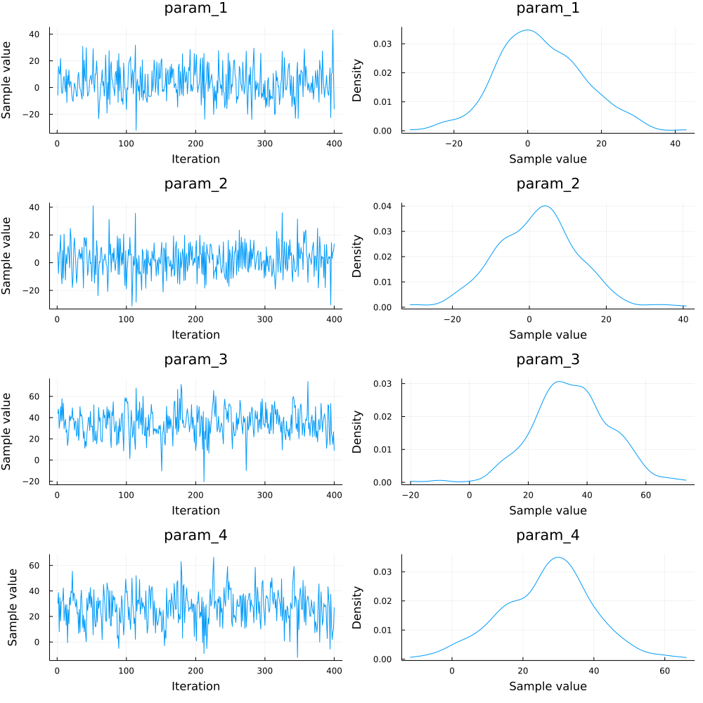

```julia
using CSV, StatsModels, DataFrames, NextGP
```

```julia
data = CSV.read("YOURPATH/phenotypes.csv",DataFrame)
```

```text
ID     Sire  Dam   Herds Pen BW
QGG5   QGG1  QGG2  1     1   35.0
QGG6   QGG3  QGG2  1     2   20.0
QGG7   QGG4  QGG6  1     2   25.0
QGG8   QGG3  QGG5  1     1   40.0
QGG9   QGG1  QGG6  2     1   42.0
QGG10  QGG3  QGG2  2     2   22.0
QGG11  QGG3  QGG7  2     2   35.0
QGG12  QGG8  QGG7  3     2   34.0
QGG13  QGG9  QGG2  3     1   20.0
QGG14  QGG3  QGG6  3     2   40.0
```


```julia
pedigree = "YOURPATH/pedigreeBase.txt"
```

    "YOURPATH/pedigreeBase.txt"

```text
#Pedigree for the above example
QGG1 0 0
QGG2 0 0
QGG3 0 0
QGG4 0 0
QGG5 QGG1 QGG2
QGG6 QGG3 QGG2
QGG7 QGG4 QGG6
QGG8 QGG3 QGG5
QGG9 QGG1 QGG6
QGG10 QGG3 QGG2
QGG11 QGG3 QGG7
QGG12 QGG8 QGG7
QGG13 QGG9 QGG2
QGG14 QGG3 QGG6
```


```julia
f = @formula(BW ~ Herds + Pen + ran(ID, ID) + ran(Dam,ID) + ran(Dam, Dam))
```


    FormulaTerm
    Response:
      BW(unknown)
    Predictors:
      Herds(unknown)
      Pen(unknown)
      (ID)->ran(ID, ID)
      (Dam,ID)->ran(Dam, ID)
      (Dam)->ran(Dam, Dam)


```julia
myHints = Dict(:Dam => StatsModels.FullDummyCoding(),:ID => StatsModels.FullDummyCoding(),:Herds => StatsModels.DummyCoding(),:Pen => StatsModels.FullDummyCoding())
```


```julia
blk = [(:Herds,:Pen)]
```


```julia
priorVar = Dict(:ID => ("A",150),
                :Dam => ("A",90),
                :(1|Dam) => ("I",40),
                :e => ([],350))
```


```julia
runGibbs(f,data,5000,1000,10;myHints=myHints,blockThese=blk,VCV=priorVar,userPedData=pedigree)
```

    MCMC progress... 100%|███████████████████████████████████| Time: 0:08:32


    outMCMC has been created to store the MCMC output
    Building parts of MME
    Herds is Term type
    Pen is Term type
    (ran(ID,ID)) is ran Type
    sym1: ID sym2: ID
    (ran(Dam,ID)) is ran Type
    sym1: Dam sym2: ID
    (ran(Dam,Dam)) is ran Type
    sym1: Dam sym2: Dam
    number of markers: Any[]
    ("Herds", "Pen")
    priorVCV structure for ("ID", "ID") is A, computed A matrix will be used
    priorVCV structure for ("Dam", "ID") is A, computed A matrix will be used
    priorVCV structure for ("Dam", "Dam") is empty, an identity matrix will be used
    e is univariate
    number of regions: Any[]


```julia
postMCMC_b = summaryMCMC("b",summary=true)
```


    Chains MCMC chain (400×4×1 Array{Float64, 3}):
    
    Iterations        = 1:1:400
    Number of chains  = 1
    Samples per chain = 400
    parameters        = param_1, param_2, param_3, param_4
    
    Summary Statistics
			mean      std      naive_se    mcse      ess       rhat    
         param_1    3.4966   11.5168     0.5758    0.5996   367.7749    1.0019
         param_2    1.9941   10.6965     0.5348    0.4786   514.1442    0.9991
         param_3   34.6249   13.1674     0.6584    0.8944   196.3730    0.9996
         param_4   26.9112   12.8549     0.6427    1.0136   199.1124    1.0003
    
...............





```julia
postMCMC_u = summaryMCMC("varU",summary=true)
```

    Chains MCMC chain (400×3×1 Array{Float64, 3}):
    
    Iterations        = 1:1:400
    Number of chains  = 1
    Samples per chain = 400
    parameters        = param_1, param_2, param_3
    
    Summary Statistics
    			mean      std      naive_se    mcse      ess       rhat
         param_1   96.1806   82.0867     4.1043    4.1074   306.2494    1.0005
         param_2   66.2353   65.5439     3.2772    4.7650   300.4542    0.9992
         param_3   29.0011   28.2076     1.4104    1.4688   346.3286    1.0012
    
................


```julia
postMCMC_e = summaryMCMC("varE",summary=true)
```


    Chains MCMC chain (400×1×1 Array{Float64, 3}):
    
    Iterations        = 1:1:400
    Number of chains  = 1
    Samples per chain = 400
    parameters        = param_1
    
    Summary Statistics
    			mean      std      naive_se    mcse      ess       rhat
         param_1   142.1475   86.5155     4.3258    3.7103   426.5393    1.0002
    
..............


